### INTRODUCTION

**canvas-painting** is a base web component with a set of methods available that go straight on the point on creating reusable canvas illustrations.

### FEATURES

**Reusable** - Once your painting is programmed, a simple html attribute can bring thousands of canvas to life, replicating the exact behavior for each one, but with datasets, it is still possible to make individual scope changes.

**Straight to the point** - With the available methods, the only job is to bring the painting to the canvas.

**Stats** - Monitor real-time information of his painting with [Stats](http://mrdoob.github.io/stats.js). By giving the command, the service is automatically embedded in your project.

### GETTING STARTED

TODO

### EXAMPLES

Here are some animated illustrations made on Codepen that show canvas-painting working.

- [Canvas Painting Example](https://codepen.io/FelixLuciano/pen/KKpMexR) - Canvas Painting Example
- [Flame 🔥](https://codepen.io/FelixLuciano/pen/ZEGpqdM) - Canvas generative Flame made with Trigonometry functions
- [Cyclic Lines 🌀](https://codepen.io/FelixLuciano/pen/eYNWoGb) - Animated canvas illustration
- [Stars ✨](https://codepen.io/FelixLuciano/pen/abOywWw) - Blinking stars
- [Atomus 💫](https://codepen.io/FelixLuciano/pen/PoqjZpb) - Animated atomic orbitals diagram
- [São Paulo 🏙](https://codepen.io/FelixLuciano/pen/qBdZErJ) - São Paulo streets pattern made with sine wave

### LICENSE
[MIT](https://github.com/FelixLuciano/canvas-painting/blob/master/LICENSE)

**Copyright (c) 2019 Luciano Felix**
